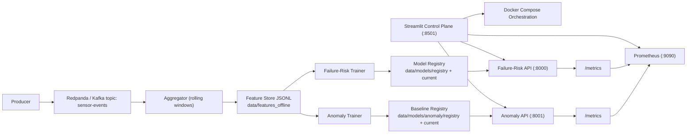

# Predictive Maintenance Platform

End-to-end local ML system for industrial telemetry with two online goals:

- Failure-risk prediction (`probability + risk level`)
- Anomaly detection (`flag + severity + triggers`)

This repo includes:

- Streaming data generation over Kafka (Redpanda)
- Rolling feature aggregation
- Offline feature storage for reproducible training/inference
- Model training + serving APIs
- Prometheus monitoring
- Streamlit control plane for operations + demo scenarios

NASA C-MAPSS is included as a separate benchmark track (not part of the live Streamlit pipeline UI).

C-MAPSS benchmark results table:

- [C-MAPSS benchmark table](reports/cmapss_benchmark_table.md)

## 1) Full Pipeline Story

This project simulates a real predictive-maintenance workflow from raw telemetry to model decisions:

1. `producer` continuously streams synthetic sensor data (`temperature`, `vibration`, `pressure`, `rpm`, `load`) into Kafka (`sensor-events`).
2. `aggregator` consumes that stream, computes rolling features (short and long windows), and writes partitioned JSONL feature files.
3. Training jobs read those features and update:
   - failure-risk model artifacts (`models/registry`, `models/current`)
   - anomaly baseline artifacts (`models/anomaly/registry`, `models/anomaly/current`)
4. Serving APIs load current artifacts and score machine behavior:
   - failure-risk API returns probability + risk level
   - anomaly API returns anomaly flag + severity + trigger reasons
5. Streamlit UI and Prometheus provide operations visibility:
   - fleet status, model outputs, and root-cause style explanations
   - telemetry/serving metrics and health checks

Default simulation cadence:

- sensor events are emitted every ~1 second
- feature flushes happen every ~5 seconds

Retraining cadence:

- retraining is designed to be run at regular intervals (for example every 30-60 minutes) via UI/CLI in this version
- after retraining, services use the new `current` artifacts after reload/restart

## 2) Architecture



## 3) Main Components

Core services:

- `redpanda`
- `init-topic`
- `producer`
- `aggregator`
- `prometheus`

ML profile services:

- `failure-risk-trainer`
- `failure-risk-service`
- `anomaly-trainer`
- `anomaly-service`
- `cmapss-trainer` (separate benchmark track)

## 4) Quick Start

From repo root:

```bash
# start UI (installs dependencies once)
./scripts/ui.sh --install
./scripts/ui.sh
```

Open:

- [http://localhost:8501](http://localhost:8501)

Use the UI tabs in this order:

1. `Data Generation` -> Start producer + aggregator.
2. `Failure-Risk` -> Train, then start service.
3. `Anomaly` -> Train baseline, then start service.
4. `Demo Scenarios` -> Run fault simulations and view model behavior over time.
5. `Monitoring` -> Start/check Prometheus targets and queries.

## 5) Streamlit Control Plane

File: `ui/streamlit_app.py`

Tabs:

- `Overview`
  - Compose container status
  - Feature file growth chart
- `Data Generation`
  - Start/stop generation, optional clear-data
  - Latest feature rows and signal trends
- `Failure-Risk`
  - Train/start/stop/status
  - Single and fleet predictions
  - Local risk-driver explanation (feature-level delta impact)
- `Anomaly`
  - Train/start/stop/status
  - Single and fleet anomaly scoring
  - Severity/anomaly score visualization
- `Demo Scenarios`
  - Scenario simulation (`Normal Drift`, `Bearing Wear`, `Overheating`, `Pressure Leak`, `Overload`)
  - Side-by-side failure-risk and anomaly timelines
  - Incident narrative summary per machine
- `Monitoring`
  - Prometheus lifecycle controls
  - Targets view + ad-hoc PromQL

## 6) Data and Model Flow

### 6.1 Features

`aggregator` writes rolling features to:

- `data/features_offline/dt=YYYY-MM-DD/hour=HH/part-*.jsonl`

These files are the feature source used by trainers and "latest row" UI flows.

### 6.2 Failure-risk

- Trainer: `app/failure_risk_trainer/train.py`
- API: `app/failure_risk_service/app.py`

Endpoints:

- `GET /health`
- `GET /model/info`
- `GET /metrics`
- `POST /reload`
- `POST /predict`
- `GET /predict/latest/{machine_id}`

### 6.3 Anomaly

- Trainer: `app/anomaly_trainer/train_anomaly.py`
- API: `app/anomaly_service/app.py`

Detection logic:

- Hard limits
- Z-score vs learned baseline
- Persistence windows for alert stability

Endpoints:

- `GET /health`
- `GET /baseline/info`
- `GET /metrics`
- `POST /reload`
- `POST /anomaly`
- `GET /anomaly/latest/{machine_id}`

## 7) Operations CLI (Non-UI)

Main script:

- `scripts/pipeline.sh`

Help:

```bash
./scripts/pipeline.sh --help
```

Primary command groups:

- `data_generation <start|stop|status>`
- `failure-risk-prediction <train|start|stop|status>`
- `anomaly <train|start|stop|status>`
- `cmapss <train|status>`

## 8) Monitoring

Prometheus config:

- `monitoring/prometheus/prometheus.yml`

Scraped jobs:

- `prometheus`
- `redpanda` (`/public_metrics`)
- `failure_risk_api` (`failure-risk-service:8000/metrics`)
- `anomaly_api` (`anomaly-service:8001/metrics`)

## 9) NASA C-MAPSS (Separate Track)

C-MAPSS is kept as a separate benchmark workflow.

Trainer:

- `app/cmapss_trainer/train_cmapss.py`

Input:

- `datasets/CMAPSSData/`

Output:

- `models/cmapss/registry/<run_id>/...`
- `models/cmapss/current/...`

Benchmark report:

- `reports/cmapss_benchmark_table.md`
- [Open benchmark table](reports/cmapss_benchmark_table.md)

Run example:

```bash
./scripts/pipeline.sh cmapss train --subset FD001
```

## 10) Repository Layout

```text
.
├── app/
├── data/
│   ├── features_offline/
│   └── run_logs/
├── datasets/
│   └── CMAPSSData/
├── docs/
│   └── api_interaction.md
├── models/
│   ├── current/
│   ├── registry/
│   ├── anomaly/
│   │   ├── current/
│   │   └── registry/
│   └── cmapss/
│       ├── current/
│       └── registry/
├── monitoring/
│   └── prometheus/
├── reports/
│   └── cmapss_benchmark_table.md
├── scripts/
│   ├── pipeline.sh
│   └── ui.sh
└── ui/
    ├── streamlit_app.py
    └── lib/
```

## 11) Troubleshooting

Check compose projects:

```bash
docker compose ls
```

Check this project explicitly:

```bash
docker compose -p predictive_maintaince_platform -f ./docker-compose.yml ps
```

Stop everything:

```bash
./scripts/pipeline.sh data_generation stop --all
```

If APIs report missing model/baseline, train first:

```bash
./scripts/pipeline.sh failure-risk-prediction train
./scripts/pipeline.sh anomaly train
```

## 12) Notes

- Failure-risk currently trains from synthetic-stream-derived labels.
- Anomaly uses baseline statistics (not a deep model).
- C-MAPSS benchmark is intentionally separate from the live simulation workflow.
- Kubernetes manifests are available in `k8s/` as an optional deployment path.
