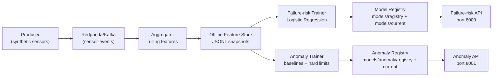

# Predictive Maintenance Platform (Streaming + Failure Risk + Anomaly Detection)

## 1) What This Project Is

This project is a local first industrial IoT predictive maintenance platform.

It simulates machine telemetry, processes it into rolling features, trains two analytics layers, and exposes real time inference APIs:

- Failure risk prediction: probability that a machine is in a high risk condition.
- Anomaly detection: rule and baseline driven detection with reason, severity, and trigger details.
- C-MAPSS benchmark training: supervised RUL(Remaining Useful Life) and failure-horizon models from NASA C-MAPSS.

The current stack is fully runnable with Docker Compose.

## 2) What It Solves

Manufacturing systems generate large continuous sensor streams. Raw sensor data by itself is not actionable. This project converts stream data into operational intelligence:

- Stream ingestion at fixed cadence.
- Feature computation over rolling windows.
- Model training from offline feature history.
- Low latency API inference for risk and anomaly.
- Versioned model and baseline artifacts.

## 3) High Level Architecture



## 4) Runtime Components

### 4.1 Core streaming services

- `redpanda`: Kafka compatible broker.
- `init-topic`: one shot topic creation job (`sensor-events`, 6 partitions).
- `producer`: publishes synthetic telemetry to Kafka.
- `aggregator`: consumes Kafka and writes feature snapshots to disk.

### 4.2 ML profile services (`--profile ml`)

- `trainer`: failure risk model training job.
- `model-service`: failure risk inference API (`:8000`).
- `anomaly-trainer`: anomaly baseline training job.
- `anomaly-service`: anomaly inference API (`:8001`).
- `cmapss-trainer`: C-MAPSS trainer for RUL + failure-risk models.

## 5) Data Flow In Detail

### 5.1 Event generation

`producer` emits one event per machine per tick.

Current default config:

- `NUM_MACHINES=10`
- `TICK_SECONDS=1`

Event schema (Kafka topic `sensor-events`):

```json
{
  "machine_id": "M-001",
  "ts": "2026-02-10T12:00:00.000000+00:00",
  "temperature": 72.3,
  "vibration": 0.21,
  "pressure": 35.4,
  "rpm": 1805,
  "load": 0.63
}
```

### 5.2 Feature aggregation

`aggregator` consumes stream events and computes per machine rolling features.

Current windows:

- short window: 5 seconds
- long window: 30 seconds

Computed outputs include:

- raw latest values
- `event_count_5s`, `event_count_30s`
- mean, std, min, max, slope for each metric over each window

Flush behavior:

- writes one `part-<epoch>.jsonl` file every `FLUSH_INTERVAL_SECONDS` (default `5`)
- path partitioning: `data/features_offline/dt=YYYY-MM-DD/hour=HH/`
- atomic write: `.tmp` file then rename
- Kafka offsets committed only after successful file write

## 6) Failure Risk Prediction Layer

### 6.1 Trainer behavior

`app/failure_risk_trainer/train.py`:

- Reads all or last `MAX_FILES` feature files.
- Uses configured `FEATURE_COLUMNS`.
- Builds synthetic labels from a risk heuristic (until real labels exist).
- Trains `StandardScaler + LogisticRegression`.
- Evaluates metrics (`accuracy`, `precision`, `recall`, `f1`, `roc_auc`).
- Writes versioned artifacts under `models/registry/<run_id>/`.
- Updates active artifact at `models/current/model.joblib`.

Why synthetic labels exist now:

- The platform currently simulates sensor stream but does not yet ingest real historical failure labels.
- This allows architecture and API validation end to end before production data onboarding.

### 6.2 Failure risk API behavior

`app/failure_risk_model_service/app.py`:

- Loads active model artifact from `models/current/model.joblib`.
- Supports direct feature inference and latest by machine lookup from snapshot files.

Endpoints:

- `GET /health`
- `GET /model/info`
- `POST /reload`
- `POST /predict`
- `GET /predict/latest/{machine_id}`

Risk levels:

- `high` if probability >= `0.7`
- `medium` if probability >= `0.4`
- `low` otherwise

### 6.3 C-MAPSS benchmark trainer behavior

`app/cmapss_trainer/train_cmapss.py` trains two supervised models from C-MAPSS subsets (`FD001`-`FD004`):

- RUL regressor: predicts remaining cycles before failure.
- Failure-risk classifier: predicts `RUL <= FAILURE_HORIZON_CYCLES` (default 30 cycles).

Feature engineering per cycle includes:

- current signal value
- delta from previous cycle
- rolling mean, std, and slope (default window 5 cycles)
- cycle position features

Output artifacts:

- `models/cmapss/registry/<run_id>/...` (versioned)
- `models/cmapss/current/...` (active)

## 7) Anomaly Detection Layer

### 7.1 Anomaly trainer behavior

`app/anomaly_trainer/train_anomaly.py`:

- Reads offline feature snapshots.
- Builds per machine baselines (and global fallback baselines).
- Computes stats per monitored feature (mean, std, percentiles, min, max).
- Stores hard limits (default plus optional override via `HARD_LIMITS_JSON`).
- Persists baseline artifact to `models/anomaly/registry/<run_id>/baseline.json`.
- Updates active baseline at `models/anomaly/current/baseline.json`.

### 7.2 Anomaly API behavior

`app/anomaly_service/app.py`:

Detection combines three concepts:

- Hard limit violations (`feature_above_hard_limit`, `feature_below_hard_limit`).
- Baseline deviation (`feature_zscore_high` with threshold).
- Persistence rule (`PERSISTENCE_WINDOWS`, default `3`) to reduce noisy alerts.

Output includes explainability fields:

- `anomaly_flag`
- `severity` (`normal`, `watch`, `medium`, `high`, `critical`)
- `reason` (top trigger code)
- `triggers` (full list of trigger details)
- `anomaly_score`

Endpoints:

- `GET /health`
- `GET /baseline/info`
- `POST /reload`
- `POST /anomaly`
- `GET /anomaly/latest/{machine_id}`

## 8) Storage and Artifact Layout

```text
.
├── data/
│   ├── features_offline/
│   │   └── dt=YYYY-MM-DD/hour=HH/part-*.jsonl
│   └── run_logs/
│       ├── pipeline_run_<timestamp>.log
│       └── pipeline_run_<timestamp>.summary
├── models/
│   ├── current/
│   │   ├── model.joblib
│   │   └── metadata.json
│   ├── registry/
│   │   └── <run_id>/
│   │       ├── model.joblib
│   │       ├── metrics.json
│   │       └── metadata.json
│   ├── anomaly/
│   │   ├── current/
│   │   │   ├── baseline.json
│   │   │   └── metadata.json
│   │   └── registry/
│   │       └── <run_id>/
│   │           ├── baseline.json
│   │           └── metadata.json
│   └── cmapss/
│       ├── current/
│       │   ├── rul_model.joblib
│       │   ├── failure_risk_model.joblib
│       │   ├── metadata.json
│       │   └── metrics.json
│       └── registry/
│           └── <run_id>/
│               ├── rul_model.joblib
│               ├── failure_risk_model.joblib
│               ├── metadata.json
│               └── metrics.json
└── scripts/
    └── pipeline.sh
```

## 9) Operations CLI (Primary Interface)

CLI path:

- `/Users/nelson/py/predictive_maintaince_platform/scripts/pipeline.sh`

API reference:

- `/Users/nelson/py/predictive_maintaince_platform/docs/api_interaction.md`

### 9.1 Domain commands

- `data_generation <start|stop|status>`
- `failure-risk-prediction <train|start|stop|status>`
- `anomaly <train|start|stop|status>`
- `cmapss <train|status>`

### 9.2 Most used commands

```bash
cd /Users/nelson/py/predictive_maintaince_platform

# streaming data generation
./scripts/pipeline.sh data_generation start
./scripts/pipeline.sh data_generation start --duration 120 --clear-data
./scripts/pipeline.sh data_generation stop --all --clear-data
./scripts/pipeline.sh data_generation status

# failure risk lifecycle
./scripts/pipeline.sh failure-risk-prediction train --build
./scripts/pipeline.sh failure-risk-prediction start
./scripts/pipeline.sh failure-risk-prediction status
./scripts/pipeline.sh failure-risk-prediction stop

# anomaly lifecycle
./scripts/pipeline.sh anomaly train --build
./scripts/pipeline.sh anomaly start
./scripts/pipeline.sh anomaly status
./scripts/pipeline.sh anomaly stop

# C-MAPSS benchmark lifecycle
./scripts/pipeline.sh cmapss train --build --subset FD001
./scripts/pipeline.sh cmapss status
```

### 9.3 Backward compatibility aliases

Still accepted:

- `start`, `stop`, `status`, `run`
- `train`, `model`, `model-start`, `model-stop`, `model-status`
- `anomaly-train`, `anomaly-start`, `anomaly-stop`, `anomaly-status`
- `cmapss-train`

## 10) End to End Workflow (Recommended)

### Step 1: Generate fresh feature data

```bash
./scripts/pipeline.sh data_generation start --duration 120 --clear-data
```

### Step 2: Train failure risk model

```bash
./scripts/pipeline.sh failure-risk-prediction train --build
```

### Step 3: Start failure risk API

```bash
./scripts/pipeline.sh failure-risk-prediction start
curl http://localhost:8000/health
curl http://localhost:8000/model/info
curl http://localhost:8000/predict/latest/M-001
```

### Step 4: Train anomaly baseline

```bash
./scripts/pipeline.sh anomaly train --build
```

### Step 5: Start anomaly API

```bash
./scripts/pipeline.sh anomaly start
curl http://localhost:8001/health
curl http://localhost:8001/baseline/info
curl http://localhost:8001/anomaly/latest/M-001
```

### Step 6 (Optional): Train on NASA C-MAPSS

```bash
./scripts/pipeline.sh cmapss train --build --subset FD001
./scripts/pipeline.sh cmapss status
```

## 11) Configuration Reference

### 11.1 Data generation and aggregation

- `NUM_MACHINES`
- `TICK_SECONDS`
- `MAX_RUNTIME_SECONDS`
- `WINDOW_SHORT_SECONDS`
- `WINDOW_LONG_SECONDS`
- `FLUSH_INTERVAL_SECONDS`
- `KAFKA_TOPIC`, `KAFKA_BOOTSTRAP_SERVERS`

### 11.2 Failure risk training and service

- `MIN_SAMPLES`, `TEST_SIZE`, `MAX_FILES`
- `FEATURE_COLUMNS`
- `MODEL_REGISTRY_DIR`, `MODEL_CURRENT_DIR`, `MODEL_PATH`
- `MAX_SCAN_FILES`

### 11.3 Anomaly baseline and service

- `MIN_SAMPLES`, `MIN_MACHINE_SAMPLES`, `MAX_FILES`
- `MONITORED_FEATURES`
- `HARD_LIMITS_JSON`
- `ZSCORE_THRESHOLD`
- `PERSISTENCE_WINDOWS`
- `ANOMALY_REGISTRY_DIR`, `ANOMALY_CURRENT_DIR`, `ANOMALY_BASELINE_PATH`

### 11.4 C-MAPSS trainer

- `CMAPSS_DATASET_DIR`
- `CMAPSS_SUBSET` (`FD001`, `FD002`, `FD003`, `FD004`)
- `CMAPSS_MODEL_REGISTRY_DIR`, `CMAPSS_MODEL_CURRENT_DIR`
- `RUL_CLIP_MAX`
- `FAILURE_HORIZON_CYCLES`
- `ROLLING_WINDOW`
- `N_ESTIMATORS`, `MAX_DEPTH`, `RANDOM_STATE`, `N_JOBS`

## 12) Current Limitations

- Features are currently persisted to files; Redis online feature store is not integrated yet.
- Failure risk labels are synthetic; real maintenance labels are not integrated yet.
- Alerting and notification channels are not yet wired.
- Canary routing between model versions is not implemented yet.

## 13) Troubleshooting

### 13.1 Duplicate containers

If you launched compose from multiple folders/project names, use a fixed project name:

```bash
docker compose -p predictive_maintaince_platform -f /Users/nelson/py/predictive_maintaince_platform/docker-compose.yml ps
```

### 13.2 No data files appearing

- Ensure producer and aggregator are both running.
- Check logs:

```bash
docker compose -p predictive_maintaince_platform -f /Users/nelson/py/predictive_maintaince_platform/docker-compose.yml logs --tail 200 producer aggregator
```

### 13.3 Trainer reports insufficient samples

- Run longer data generation first.
- Increase `--duration` or reduce `MIN_SAMPLES`.

### 13.4 APIs return missing artifact/baseline

- Train first:

```bash
./scripts/pipeline.sh failure-risk-prediction train
./scripts/pipeline.sh anomaly train
```

## 14) Kubernetes Starter

Kubernetes manifests exist under `k8s/` for future deployment evolution.

Current recommended workflow remains Docker Compose first.
